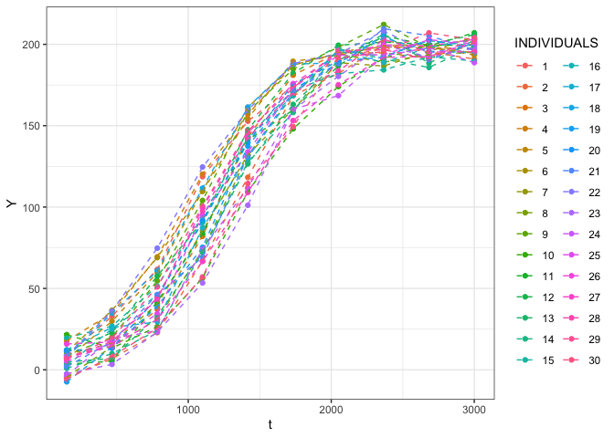
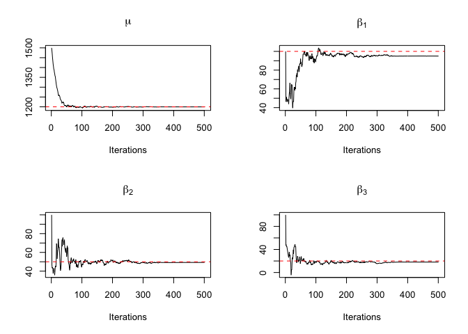
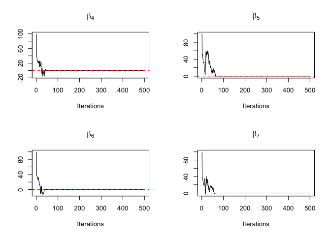
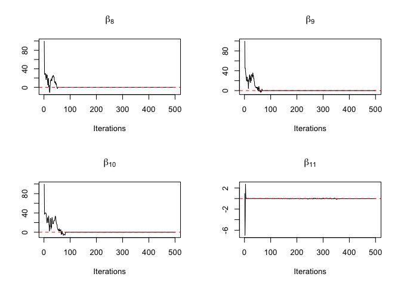
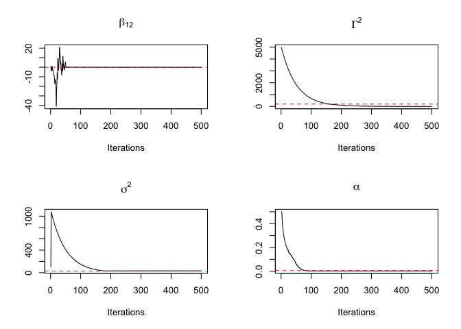
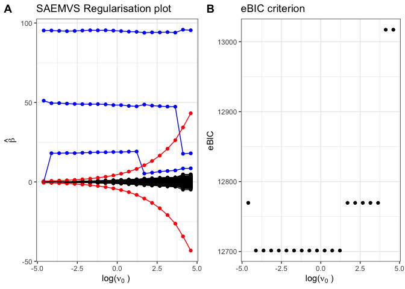

# Supporting information for the SAEMVS procedure

<!-- badges: start -->
<!-- badges: end -->
<!--ts-->
* [Supporting information for the SAEMVS procedure](#supporting-information-for-the-saemvs-procedure)
* [Application of SAEMVS on a detailed example](#application-of-saemvs-on-a-detailed-example)
   * [Model simulation](#model-simulation)
   * [Convergence of the MCMC-SAEM algorithm](#convergence-of-the-mcmc-saem-algorithm)
   * [Spike-and-slab regularisation plot and model selection](#spike-and-slab-regularisation-plot-and-model-selection)

<!-- Added by: mnaveau, at: Mar 18 oct 2022 20:01:12 CEST -->

<!--te-->

This repository contains the real data-set and the code for running the
simulations and generating exact copies of all the figures in the paper
“Bayesian high-dimensional covariate selection in non-linear
mixed-effects models using the SAEM algorithm”, Naveau M., Kon Kam King
G., Rincent R., Sansonnet L., and Delattre M.

The file ‘CONTENT_OF_FILE’ contains a description of all files in this
GitHub directory.

# Application of SAEMVS on a detailed example

``` r
rm(list=ls())

library(ggplot2)
library(nlme)
library(cowplot)
library(glmnet)
```

    ## Le chargement a nécessité le package : Matrix

    ## Loaded glmnet 4.1-3

``` r
library(mvnfast)
library(doParallel)
```

    ## Le chargement a nécessité le package : foreach

    ## Le chargement a nécessité le package : iterators

    ## Le chargement a nécessité le package : parallel

For this example, the following logistic growth model is considered:
$y_{ij}= \dfrac{\psi_1}{1+\exp\left(-\dfrac{t_{ij}-\varphi_i}{\psi_2}\right)}+ \varepsilon_{ij} ,\text{ with } \varepsilon_{ij} \overset{\text{i.i.d.}}{\sim} \mathcal{N}(0,\sigma^2)$

and $\varphi_i = \mu + \mathstrut^t{\beta} V_i+ \xi_i , \text{ with } \xi_i \overset{\text{i.i.d.}}{\sim} \mathcal{N}(0,\Gamma^2),$

where *ψ*<sub>1</sub> and *ψ*<sub>2</sub> are known constants. This is a
common and realistic model used in many fields of life sciences, such as
plant growth for example. Let us consider the following parameters:

``` r
n=200                          #number of individuals
J=10                           #number of repetitions
p=500                          #number of covariates
sigma2=30                      #residual variance of y
Gamma2=200                     #inter-individual variance of phi_i
mu=1200                        #intercept
beta=c(100,50,20,rep(0,p-3))   #covariate fixed effects vector
beta_tilde=c(mu,beta)          #useful reformulation
psi1=200                       #parameter of the function g
psi2=300                       #parameter of the function g
psi=c(psi1,psi2)
```

Thus, only the first three covariates are influential,
*S*<sub>*β*</sub><sup>\*</sup> = {1, 2, 3}.

## Model simulation

For each individual, the *p* covariates are simulated independently
according to standard normal distributions 𝒩(0,1).

``` r
s=0
set.seed(s)
V_tilde=matrix(NA,nrow=n,ncol=p+1)
V_tilde[,1]=rep(1,n)
for (i in 1:n) {
  V_tilde[i,2:(p+1)]=rmvn(1,mu=rep(0,p),sigma=diag(1,p))
}
V_tilde[,c(2:(p+1))]=scale(V_tilde[,c(2:(p+1))])
V=V_tilde[,-1]
```

Then, the latent variables $\varphi_i$ are simulated like:

``` r
phi=rep(0,n)
for (i in 1:n){
  phi[i]=sum(beta_tilde*V_tilde[i,]) + rnorm(1,mean=0,sd=sqrt(Gamma2))
}
```

and next, the observed data *y* are simulated as follows:

``` r
g <- function(phi_i,psi,t_ij){
  return(psi[1]/(1+exp(-(t_ij-phi_i)/psi[2])))
}

Y=rep(0,n*J)                    #vector of y_ij with y_ij=Y[(i-1)*J+j]
t=rep(seq(150,3000,length=J),n) #vector of t_ij with x_ij=x[(i-1)*J+j]
for (i in 1:n){
  for (j in 1:J) {
    Y[(i-1)*J+j]=g(phi_i=phi[i],psi=psi,t_ij=t[(i-1)*J+j])+rnorm(1,mean=0,sd=sqrt(sigma2))
  }
}

Id=rep(c(1:n),each=J)
data=data.frame(Id,Y,t)

# Data representation
id=as.matrix(Id)
data2=data[id<=30,]
ggplot(data2, aes(x=t, y=Y, group=Id,color=as.factor(Id))) + geom_point() +
geom_line(linetype = "dashed") + theme_bw() +labs(color = "INDIVIDUALS")
```



## Convergence of the MCMC-SAEM algorithm

Algorithm 1 is initialised here with:

``` r
betatilde_init=c(1500,rep(100,10),rep(1,p-10))
sigma2_init=100
Gamma2_init=5000
alpha_init=0.5
```

Indeed, in practice, to avoid convergence toward a local maximum in the
MCMC-SAEM algorithm, a simulated annealing version of SAEM (see
Lavielle, 2014) is implemented. More precisely, *Γ*<sup>2</sup> is
initialised very large to explore the space during the first iterations
and at iteration *k*:
$$\\Gamma^{2^{(k+1)}}=max(\\tau \\Gamma^{2^{(k)}}, \\underset{\\Gamma^2 \>0}{\\operatorname{argmax}} \\text{ } Q\_{k+1}(\\Theta).) $$
with *τ* = 0, 98.

``` r
tau=0.98
```

The hyperparameters are set to:

``` r
nu0=0.02           #spike parameter
nu1=12000          #slab parameter
nu_Gamma=1         #prior parameter of Gamma2
lb_Gamma=1         #prior parameter of Gamma2
nu_sigma=1         #prior parameter of sigma2
lb_sigma=1         #prior parameter of sigma2
a=1                #prior parameter of alpha
b=p                #prior parameter of alpha
sigma2_mu=3000^2   #prior parameter of mu
```

and the algorithmic parameters are set to:

``` r
param_init=list(beta_tilde=betatilde_init,alpha=alpha_init,Gamma2=Gamma2_init,
                sigma2=sigma2_init) 
#list of initialisations of the parameters to be estimated 

hyperparam=list(nu0=nu0,nu1=nu1,nu_Gamma=nu_Gamma,lb_Gamma=lb_Gamma,nu_sigma=nu_sigma,
                lb_sigma=lb_sigma,a=a,b=b,sigma2_mu=sigma2_mu,psi=psi,tau=tau) 
#list of hyperparameters

niter=500         #number of iterations of the algorithm
nburnin=350       #number of burn-in iterations (see Appendix A.1)
niterMH_phi=1     #number of iterations of the Metropolis Hastings algorithm for 
                  #phi at S-step
```

We import the functions we will need:

``` r
source('R/Functions_SAEMVS.R')
```

This file contains:

-   SAEM_MAP: function that corresponds to the MCMC-SAEM algorithm
    presented in section 3 which allows to calculate the MAP estimator,
    Algorithm 1, appendix A.1. This function takes as input (niter,
    nburnin, niterMH_phi, Y, t, id, V_tilde, param_init, hyperparam, s)
    where all these parameters are defined above and s is the seed. It
    returns beta_tilde a (*p*+1)×(niter+1) matrix where columns are the
    MAP estimation vector of *β̃* over the iterations, and Gamma2,
    sigma2, alpha are vectors of size niter+1 containing the MAP
    estimates of *Γ*<sup>2</sup>, *σ*<sup>2</sup> and *α*, respectively,
    during the iterations.
-   p_star: function used in SAEM_MAP and which corresponds to
    equation (9) in the paper that is the the conditional expectation of
    *δ* knowing (*φ*,*y*,*Θ*<sup>(*k*)</sup>). It takes as input
    (*β*<sup>(*k*)</sup>,*α*<sup>(*k*)</sup>,*ν*<sub>0</sub>,*ν*<sub>1</sub>,*p*)
    and returns this conditional expectation.
-   g: function that corresponds to the logistic growth model.
-   SAEM_EMV: function that corresponds to the MCMC-SAEM algorithm which
    calculates the MLE needed to determine the value of the eBIC
    criterion. It takes as input the same parameters as SAEM_MAP except
    hyperparam, that corresponds here to a list that contains *ψ* and
    *τ*, and we also put in input *I*, which is a set of indices ℓ such
    that *β̃*<sub>ℓ</sub> ≠ 0. This function returns for each parameter
    its maximum likelihood estimator.
-   Model_selection: function that corresponds to the proposed variable
    selection procedure SAEMVS, Algorithm 2 in appendix A.2. It takes
    as input (Delta, niter, nburnin, niterMH_phi, Y, t, id, V_tilde,
    param_init, hyperparam, s), where Delta is the grid of nu0 values.
    This function returns a list that contains a graph with the
    regularisation plot and the value of the eBIC criterion, the
    selected model (the set of selected covariates), the values of the
    MAP estimates $\\hat{\\tilde{\\beta}}$, $\\hat{\\Gamma^2}$ and
    $\\hat{\\sigma^2}$ for the selected model, the selected
    *ν*<sub>0</sub>, the values of the MAP estimates of each parameters
    for each value of *ν*<sub>0</sub> in the grid, and the a posteriori
    inclusion probability of each covariates knowing *Θ̂* for each value
    of *ν*<sub>0</sub>.

The following figure represents the convergence graphs of one run of the
MCMC-SAEM algorithm for *μ*, some components of *β*, *σ*<sup>2</sup>,
*Γ*<sup>2</sup> and *α*. It is observed that the algorithm converges in
a few iterations for any parameter.

``` r
res=SAEM_MAP(niter, nburnin, niterMH_phi,Y,t,id, V_tilde, param_init,hyperparam,s)

par(mfrow=c(2,2))
for (k in 1:13){
  if (k==1){
    plot(res$beta_tilde[k,],xlab="Iterations",ylab="",main=expression(mu),type='l')
    abline(h=beta_tilde[k],col="red",lty=2)
  }
  else {
    plot(res$beta_tilde[k,],xlab="Iterations",ylab="",main=substitute(exp = beta[valeur_k],
    env = list(valeur_k = k-1)),type='l')
    abline(h=beta_tilde[k],col="red",lty=2)
  }
}
```



``` r
plot(res$Gamma2,xlab="Iterations",ylab="",main=expression(Gamma^2),type='l')
abline(h=Gamma2,col="red",lty=2)
plot(res$sigma2,xlab="Iterations",ylab="",main=expression(sigma^2),type='l')
abline(h=sigma2,col="red",lty=2)
plot(res$alpha,xlab="Iterations",ylab="",main=expression(alpha),type='l')
abline(h=3/p,col="red",lty=2)
```



In this example, after 500 iterations, the algorithm returns
$\widehat{\mu}^{MAP} = 1199.6$,
$\widehat{\beta_1}^{MAP} = 95.0$,
$\widehat{\beta_2}^{MAP} = 49.3$,
$\widehat{\beta_3}^{MAP} = 18.1$,
$\widehat{\sigma^2}^{MAP} = 32.68$,
$\widehat{\Gamma^2}^{MAP} = 2.11$ and
$\widehat{\alpha}^{MAP} = 0.003$:

``` r
res$beta_tilde[1:4,niter+1]
```

    ## [1] 1199.62606   95.00631   49.30714   18.06477

``` r
res$sigma2[niter+1]
```

    ## [1] 32.67775

``` r
res$Gamma2[niter+1]
```

    ## [1] 2.105609

``` r
res$alpha[niter+1]
```

    ## [1] 0.003004958

Moreover, the estimates of the null fixed effects of the covariates are
all less than 0.07 in absolute value.

``` r
all(abs(res$beta_tilde[5:(p+1),niter+1])<=0.07)
```

    ## [1] TRUE

Note that the parameters are all relatively correctly estimated, except
for *Γ*<sup>2</sup> but this was expected because of a over-fitting
situation. Indeed, the underestimation of *Γ*<sup>2</sup> can be
explained by the fact that since *ν*<sub>0</sub> \> 0, none of the
estimates of the coefficients of *β* is zero and therefore all the
covariates are active in the model, which makes the variance estimation
of the random effect tend towards 0. This illustrates the need to
threshold the estimators as described in Subsection 3.3.

## Spike-and-slab regularisation plot and model selection

To illustrate how the variable selection works, SAEMVS is applied on
this simulated example on the grid of *ν*<sub>0</sub> values *Δ* such
that
$$\\log\_{10}(\\Delta)=\\bigg\\{-2 + k\\times \\dfrac{4}{19}, k \\in \\{0, \\dots, 19\\}\\bigg\\}.$$

``` r
M=20
Delta=10^(seq(-2,2,length.out = M)) 
```

To have a visual representation of this procedure, a spike-and-slab
regularisation plot inspired from is drawn. It represents the evolution
of the *β*<sub>ℓ</sub> estimates for all ℓ ∈ {1, …, *p*} along the grid
of *ν*<sub>0</sub>, and the value of the selection threshold associated
with *ν*<sub>0</sub> ∈ *Δ*.

``` r
res=Model_selection(Delta,niter,nburnin,niterMH_phi,Y,t,id,V_tilde,param_init,hyperparam,s)

res$graph
```



The regularisation plot on the Figure (A) shows the MAP estimates of the
covariate fixed effects vector *β* obtained for each
*ν*<sub>0</sub> ∈ *Δ*. The blue lines are associated with the three
relevant covariates, while the black lines are associated with the null
fixed effects of the covariates. Moreover, the red lines correspond to
the selection threshold of the covariates. Thus, for each
*ν*<sub>0</sub> ∈ *Δ*, the selected covariates
$\widehat{S}_{\nu_0}$ are those associated with a
$(\widehat{\beta}^{MAP}_{\nu_0})_{\ell}$ located
outside the two red curves in the regularisation plot.

As expected, the larger *ν*<sub>0</sub> is, the smaller the support of
the associated $\widehat{\beta}^{MAP}_{\nu_0}$ is.
Indeed, on the one hand, the selection threshold increases with
*ν*<sub>0</sub>, and on the other hand, the larger *ν*<sub>0</sub> is,
the more
$(\widehat{\beta}^{MAP}_{\nu_0})_{\ell}$’s are
truncated in the spike distribution. This illustrates the interest of
going through a grid rather than focusing on a single *ν*<sub>0</sub>
value.

Figure (B) represents the value of the eBIC criterion for all
*ν*<sub>0</sub> in *Δ*. As desired, it is minimal for the values of
*ν*<sub>0</sub> for which exactly the right model is selected. The
procedure returns the second value of *ν*<sub>0</sub> ∈ *Δ*,
$\widehat{\nu}_0$ ≈ 0.016, and $\widehat{S}_{\widehat{\nu}_0}$ = {1, 2, 3}.
So, in this simulated example, SAEMVS returns exactly the right model,
that is the one with only the first three covariates:

``` r
res$nu0_select
```

    ## [1] 0.01623777

``` r
res$model_select
```

    ## [1] 1 2 3
